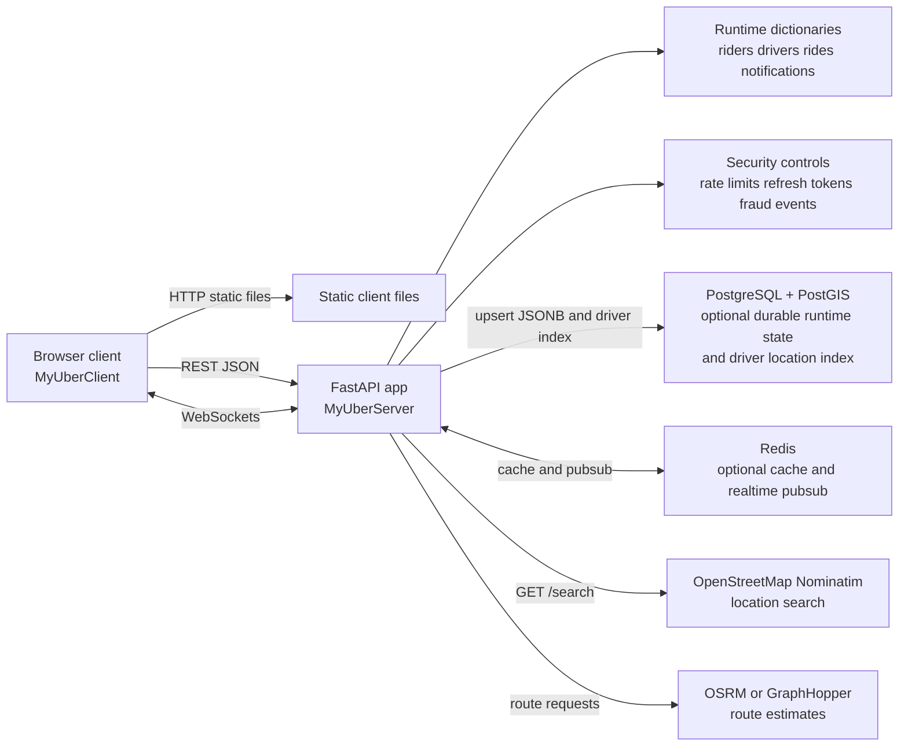
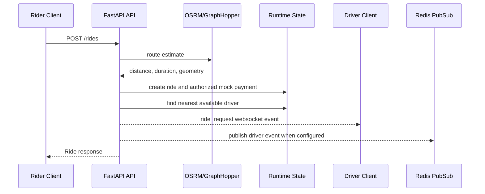
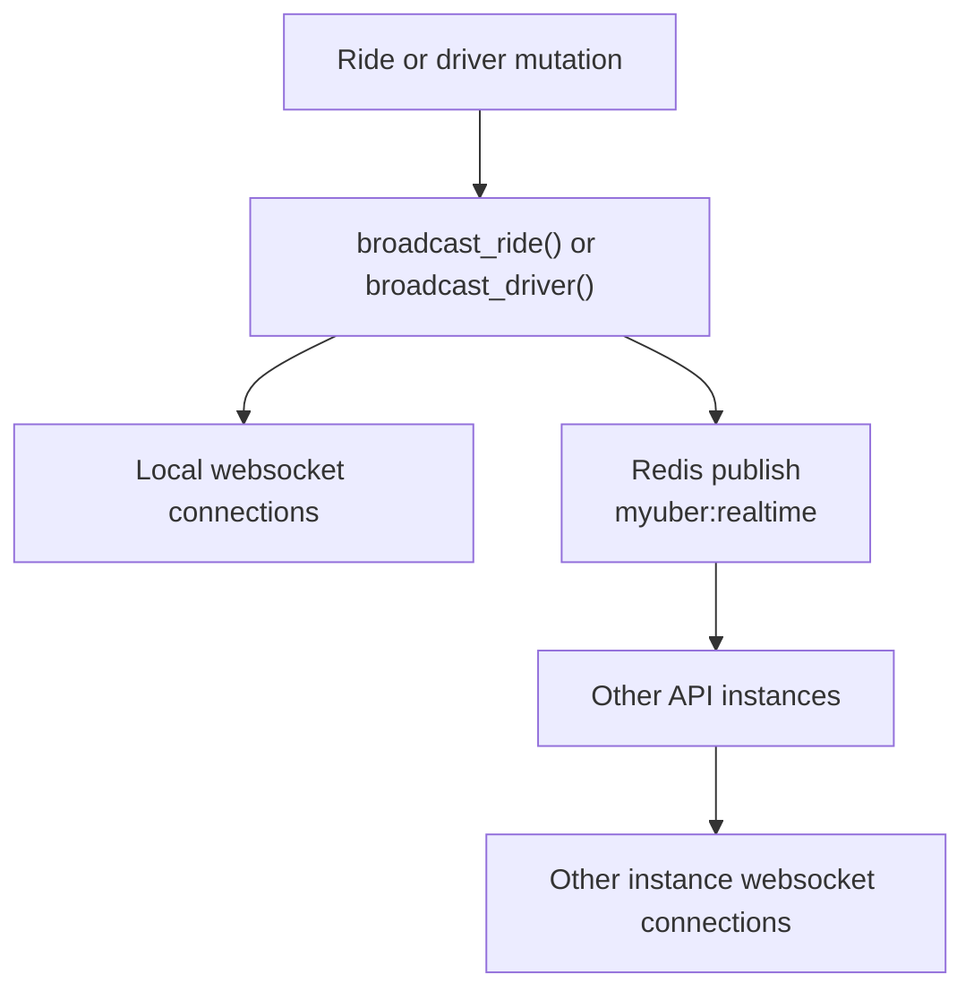

# Architecture Diagram

MyUber is a small ride-hailing demo application with a TypeScript browser
client, a FastAPI backend, optional PostgreSQL/PostGIS persistence, optional
Redis cache/pubsub, and external map/routing providers.

## System Diagram

## Backend Responsibilities

The FastAPI app handles:

- account signup/login for riders, drivers, and admins
- short-lived JWT auth, rotating refresh tokens, and role checks
- rate limiting for sensitive and high-volume HTTP endpoints
- basic fraud/risk scoring during ride creation and admin risk reporting
- account suspension and admin operations
- driver document verification gates availability and dispatch eligibility
- location search through Nominatim
- route and fare estimates through OSRM or GraphHopper
- ride creation, matching, progression, cancellation, rating, issues, sharing,
  refunds, and history
- dispatch timeout processing and admin demand heatmap aggregation
- driver availability, location updates, and earnings
- notification creation and unread counts
- WebSocket fanout for rides, drivers, and public share links

## Frontend Responsibilities

The TypeScript client handles:

- access and refresh token storage in `localStorage`, plus access-token refresh
  and retry for authenticated API calls
- REST API calls through `src/api.ts`
- realtime socket connection, heartbeat, reconnect, and message queuing through
  `src/socket.ts`
- location publishing and route refresh intervals from `src/config.ts`
- map, directions, ride, and UI state modules under `src/`

## Request Ride Flow

## Realtime Architecture

If Redis is unavailable or not configured, realtime still works for clients
connected to the same API process.

## Data And Failure Behavior

- If `DATABASE_URL` is missing or PostgreSQL connection fails, the app uses
  in-memory state only.
- If PostGIS setup fails, nearest-driver matching falls back to Haversine
  sorting in Python.
- If Redis is missing or unavailable, caching and cross-instance websocket
  fanout are skipped.
- If the configured routing provider fails, route estimates fall back to an
  adjusted straight-line estimate.
- A default admin is created at startup from `MYUBER_ADMIN_EMAIL` and
  `MYUBER_ADMIN_PASSWORD`.
- JWT signing uses `MYUBER_SECRET_KEY`. If it is missing, the API generates a
  temporary in-memory secret and logs a warning.
- Access tokens default to 15 minutes. Refresh tokens default to 30 days, are
  stored server-side only as hashes, and rotate on every refresh.
- Rate limiting uses Redis counters when Redis is connected and in-memory
  counters otherwise.
