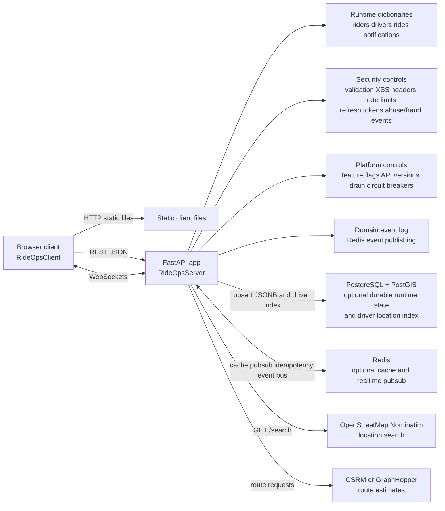
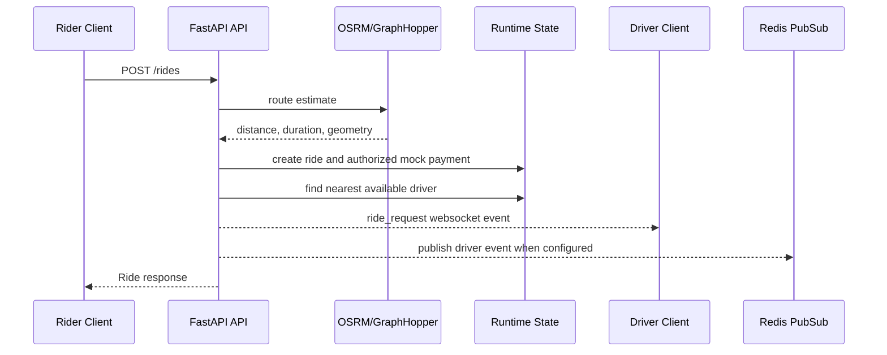
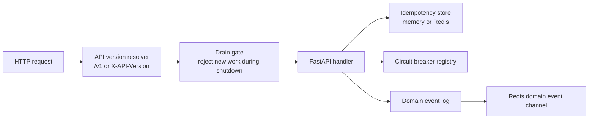

# Architecture Diagram

RideOps is a small ride-hailing demo application with a TypeScript browser
client, a FastAPI backend, optional PostgreSQL/PostGIS persistence, optional
Redis cache/pubsub, and external map/routing providers.

## Code Organization

The backend keeps `app/main.py` as the FastAPI composition root, with route
registration split under `app/routes/`, demo fixtures in `app/seed.py`, and
PostgreSQL/PostGIS persistence behind `app/runtime_store.py`. Shared behavior is
documented around observable contracts: the API surface, runtime data model,
ride lifecycle, WebSocket messages, and environment configuration. Future
extraction should continue from storage and routing boundaries into pure
business policy modules with tests.

## System Diagram

## Backend Responsibilities

The FastAPI app handles:

- account signup/login for riders, drivers, and admins
- request input validation, display-text sanitization, and security response
  headers
- short-lived JWT auth, rotating refresh tokens, and role checks
- rate limiting for sensitive and high-volume HTTP endpoints
- API version prefixes and response headers for v1-compatible clients
- feature flags for controlled rollout of platform capabilities
- idempotency keys for retry-safe ride creation and wallet top-ups
- basic fraud/risk scoring during ride creation, abuse-event detection, and
  admin risk reporting
- circuit breakers around external routing, search, notification, and Redis
  publishing dependencies
- account suspension and admin operations
- driver document verification gates availability and dispatch eligibility
- location search through Nominatim
- route and fare estimates through OSRM or GraphHopper
- ride creation, matching, progression, cancellation, rating, issues, sharing,
  refunds, and history
- dispatch timeout processing and admin demand heatmap aggregation
- driver availability, location updates, and earnings
- notification creation and unread counts
- WebSocket fanout for rides, drivers, and public share links
- domain event logging and Redis publication for key platform, wallet,
  notification, and ride mutations
- graceful drain mode for rolling deploys and multi-region failover readiness

## Frontend Responsibilities

The TypeScript client handles:

- access and refresh token storage in `localStorage`, plus access-token refresh
  and retry for authenticated API calls
- REST API calls through `src/api.ts`
- realtime socket connection, heartbeat, reconnect, and message queuing through
  `src/socket.ts`
- location publishing and route refresh intervals from `src/config.ts`
- map, directions, ride, and UI state modules under `src/`

## Request Ride Flow

## Realtime Architecture

If Redis is unavailable or not configured, realtime still works for clients
connected to the same API process.

## Platform Readiness

Health and admin platform responses expose release version, API version, current
region, primary region, active regions, feature flags, breaker state, event bus
state, and drain status. `/health/ready` returns `503` while the process is
draining, but `/health/live` continues to report process liveness.

## Data And Failure Behavior

- If `DATABASE_URL` is missing or PostgreSQL connection fails, the app uses
  in-memory state only.
- PostgreSQL persistence is isolated behind `RuntimeStateStore`, which owns
  schema setup, state restore, state snapshots, and PostGIS driver-location
  projection queries.
- If PostGIS setup fails, nearest-driver matching falls back to Haversine
  sorting in Python.
- If Redis is missing or unavailable, caching and cross-instance websocket
  fanout are skipped; idempotency and event logging fall back to in-process
  memory.
- If the configured routing provider fails, route estimates fall back to an
  adjusted straight-line estimate. Repeated provider failures open the relevant
  circuit breaker until the configured recovery window elapses.
- A default admin is created at startup from `MYUBER_ADMIN_EMAIL` and
  `MYUBER_ADMIN_PASSWORD`.
- JWT signing uses `MYUBER_SECRET_KEY`. If it is missing, the API generates a
  temporary in-memory secret and logs a warning.
- Passwords are hashed with bcrypt. Signup passwords are length-checked before
  hashing and password hashes are never returned by public profile serializers.
- Access tokens default to 15 minutes. Refresh tokens default to 30 days, are
  stored server-side only as hashes, rotate on every refresh, and token-family
  reuse is recorded as abuse.
- Rate limiting uses Redis counters when Redis is connected and in-memory
  counters otherwise.
- PostgreSQL writes use static SQL and asyncpg bind parameters; user input is
  not interpolated into SQL statements.
