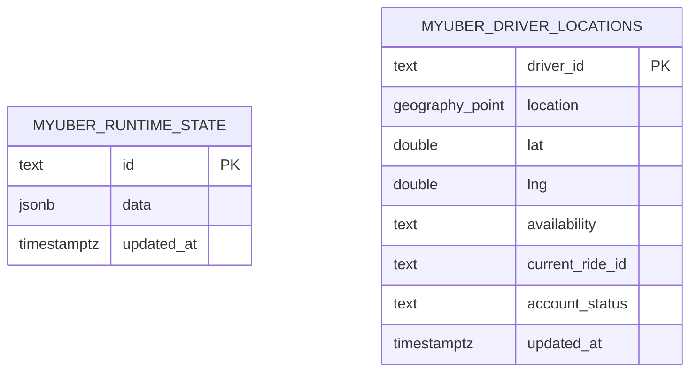
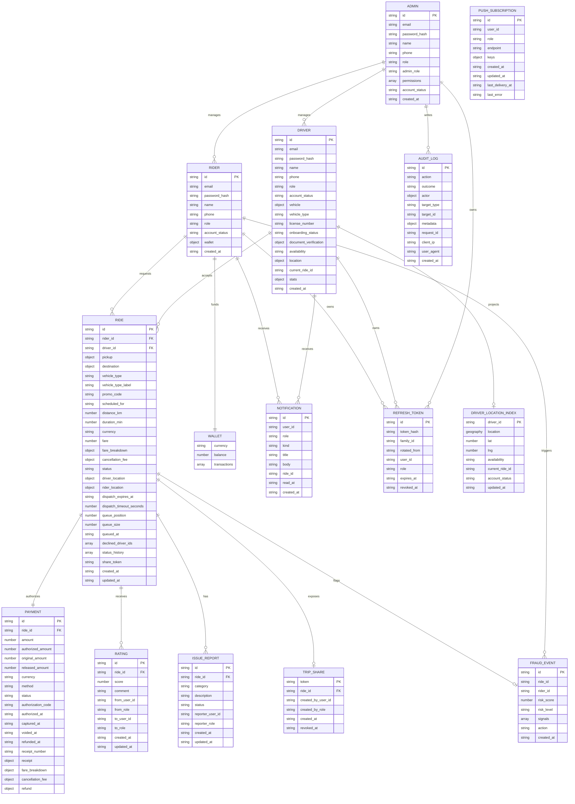
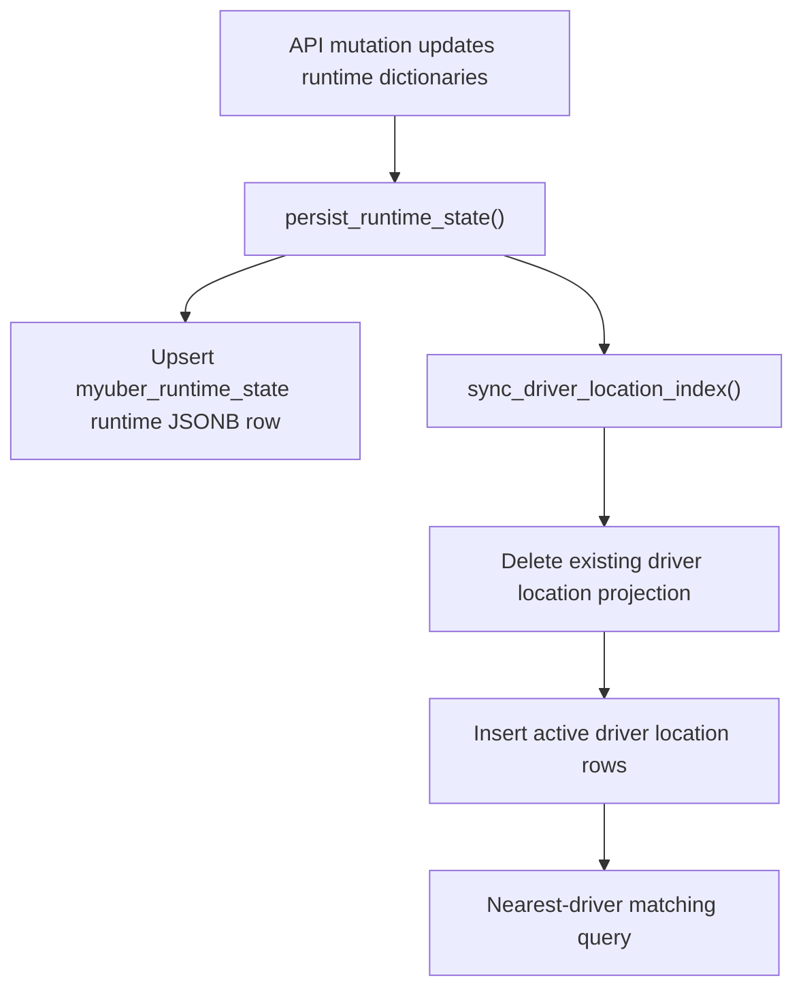

# DB Schema Diagram

MyUber uses runtime dictionaries as the primary domain store. When
`DATABASE_URL` is configured, the server persists those dictionaries into a
single JSONB row and maintains a separate PostGIS-backed driver location index
for nearest-driver queries.

Schema creation happens at FastAPI startup in `initialize_database()`.

## Physical PostgreSQL Schema



### `myuber_runtime_state`

Stores one row with `id = "runtime"`.

```sql
CREATE TABLE IF NOT EXISTS myuber_runtime_state (
    id TEXT PRIMARY KEY,
    data JSONB NOT NULL,
    updated_at TIMESTAMPTZ NOT NULL DEFAULT now()
);
```

The `data` JSON object has these top-level keys:

- `riders`
- `drivers`
- `admins`
- `rides`
- `issue_reports`
- `notifications`
- `push_subscriptions`
- `trip_shares`
- `refresh_tokens`
- `fraud_events`
- `audit_logs`

### `myuber_driver_locations`

Stores a query-optimized projection of driver locations.

```sql
CREATE TABLE IF NOT EXISTS myuber_driver_locations (
    driver_id TEXT PRIMARY KEY,
    location GEOGRAPHY(Point, 4326) NOT NULL,
    lat DOUBLE PRECISION NOT NULL,
    lng DOUBLE PRECISION NOT NULL,
    availability TEXT NOT NULL,
    current_ride_id TEXT,
    account_status TEXT NOT NULL,
    updated_at TIMESTAMPTZ NOT NULL DEFAULT now()
);

CREATE INDEX IF NOT EXISTS myuber_driver_locations_geo_idx
ON myuber_driver_locations
USING GIST (location);
```

This table is rebuilt from the in-memory `drivers` dictionary during persistence.
If PostGIS setup fails, the API falls back to in-memory Haversine sorting.

## Logical Domain Model

The runtime JSONB document stores the following logical entities.



Driver document verification is stored inside each `DRIVER.document_verification`
object. It contains mock records for required license, insurance, and vehicle
registration documents plus aggregate counts and a `status` of
`pending_review`, `verified`, or `rejected`.

## Persistence Flow



## Operational Notes

- There are no migration files in the current repo.
- PostgreSQL is optional; without it, state remains in memory for the process
  lifetime.
- PostGIS is optional; without it, matching uses in-memory distance sorting.
- Redis is not part of durable storage. It is used for route/location caching
  and websocket fanout across API instances.
