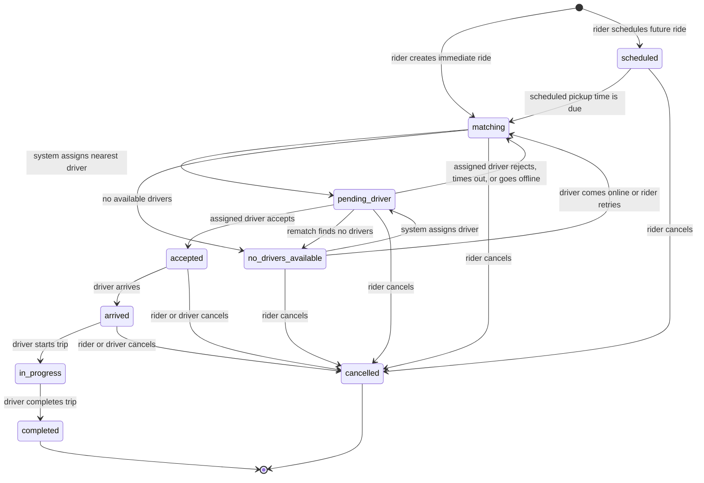

# Ride Lifecycle Diagram

Ride state transitions are enforced by `ALLOWED_RIDE_TRANSITIONS` in
`RideOpsServer/app/main.py`. Terminal states are `completed` and `cancelled`.

## State Diagram

```mermaid
stateDiagram-v2
    [*] --> matching: rider creates immediate ride
    [*] --> scheduled: rider schedules future ride

    scheduled --> matching: scheduled pickup time is due
    scheduled --> cancelled: rider cancels

    matching --> pending_driver: system assigns nearest driver
    matching --> no_drivers_available: no available drivers
    matching --> cancelled: rider cancels

    no_drivers_available --> matching: driver comes online or rider retries
    no_drivers_available --> pending_driver: system assigns driver
    no_drivers_available --> cancelled: rider cancels

    pending_driver --> accepted: assigned driver accepts
    pending_driver --> matching: assigned driver rejects, times out, or goes offline
    pending_driver --> no_drivers_available: rematch finds no drivers
    pending_driver --> cancelled: rider cancels

    accepted --> arrived: driver arrives
    accepted --> cancelled: rider or driver cancels

    arrived --> in_progress: driver starts trip
    arrived --> cancelled: rider or driver cancels

    in_progress --> completed: driver completes trip

    completed --> [*]
    cancelled --> [*]
```

