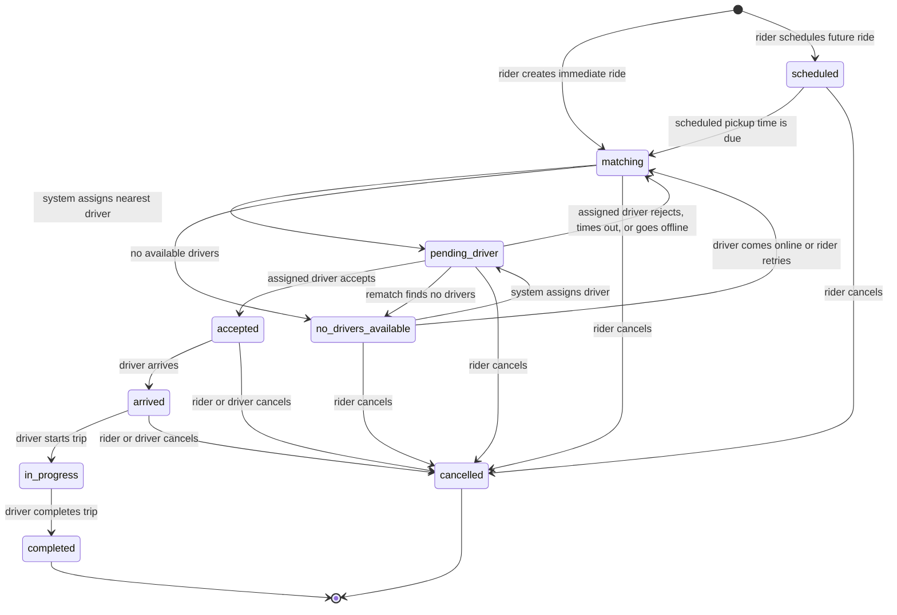
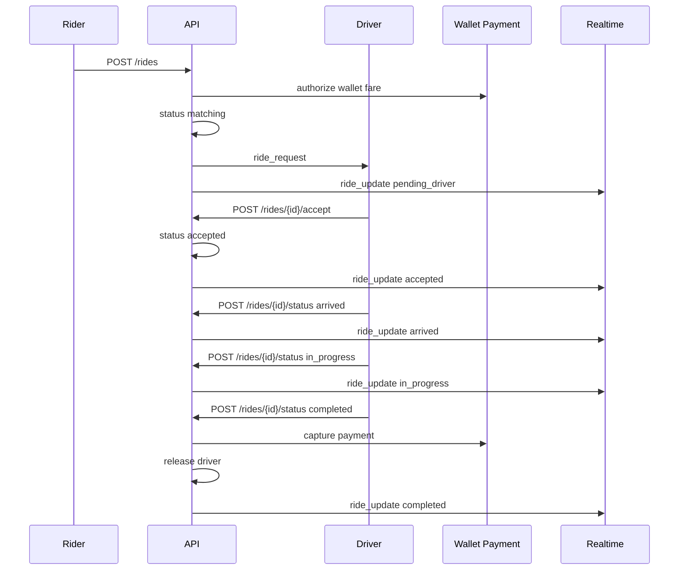

# Ride Lifecycle Diagram

Ride state transitions are enforced by `ALLOWED_RIDE_TRANSITIONS` in
`RideOpsServer/app/main.py`. Terminal states are `completed` and `cancelled`.

## State Diagram

## Transition Table

| From | To | Actor | Trigger |
| --- | --- | --- | --- |
| `scheduled` | `matching` | system | scheduled pickup time is due |
| `scheduled` | `cancelled` | rider | `POST /rides/{ride_id}/cancel` |
| `matching` | `pending_driver` | system | nearest available driver assigned |
| `matching` | `no_drivers_available` | system | no available driver candidates |
| `matching` | `cancelled` | rider | `POST /rides/{ride_id}/cancel` |
| `no_drivers_available` | `matching` | system or driver flow | waiting ride is retried |
| `no_drivers_available` | `pending_driver` | system | driver becomes available and is assigned |
| `no_drivers_available` | `cancelled` | rider | `POST /rides/{ride_id}/cancel` |
| `pending_driver` | `accepted` | driver | `POST /rides/{ride_id}/accept` |
| `pending_driver` | `matching` | driver or system | `POST /rides/{ride_id}/reject`, dispatch timeout, or driver goes offline |
| `pending_driver` | `no_drivers_available` | system | rematching finds no candidates |
| `pending_driver` | `cancelled` | rider | `POST /rides/{ride_id}/cancel` |
| `accepted` | `arrived` | driver | `POST /rides/{ride_id}/status` with `arrived` |
| `accepted` | `cancelled` | rider or driver | `POST /rides/{ride_id}/cancel` |
| `arrived` | `in_progress` | driver | `POST /rides/{ride_id}/status` with `in_progress` |
| `arrived` | `cancelled` | rider or driver | `POST /rides/{ride_id}/cancel` |
| `in_progress` | `completed` | driver | `POST /rides/{ride_id}/status` with `completed` |

## Main Flow

## Side Effects By State

### `matching`

- Ride has been created and a wallet payment is `authorized`.
- The ride is in the dispatch queue until an available active driver of the
  requested vehicle type can be assigned.
- Matching uses PostGIS when available; otherwise it uses in-memory Haversine
  distance sorting.

### `scheduled`

- Ride has a future `scheduled_for` timestamp and a wallet payment is
  `authorized`.
- The scheduler moves it into `matching` when the pickup time is due.
- Rider can cancel from this state.

### `pending_driver`

- A driver has been selected.
- Driver availability becomes `pending`.
- Driver `current_ride_id` is set.
- Driver receives a `ride_request` websocket event.
- Rider and driver receive notifications.
- `dispatch_expires_at` is set from `MYUBER_DISPATCH_TIMEOUT_SECONDS`; if the
  driver does not accept or reject before then, the ride is returned to
  `matching` and the driver is added to the declined set.

### `accepted`

- Driver accepted the request.
- Driver availability becomes `busy`.
- Driver accepted counter increments.
- Rider receives a notification.

### `arrived`

- Driver reached the pickup point.
- Rider receives a notification.

### `in_progress`

- Trip has started.
- Rider receives a notification.

### `completed`

- Wallet payment is captured and marked `paid`.
- A detailed receipt is generated and attached to the payment.
- A receipt email is sent through SMTP when configured, or logged locally in
  development.
- Rider wallet balance is debited for the final fare.
- Driver is released and becomes `available` unless they are offline.
- Rider and driver receive completion notifications, with push delivery when
  browser subscriptions and VAPID keys are configured.
- Ride can now be rated by both rider and driver.
- Rider may simulate a refund with `POST /rides/{ride_id}/refund`.

### `cancelled`

- Authorized wallet payment is voided for no-fee cancellations.
- Rider cancellation from `accepted` or `arrived` charges a cancellation fee
  before releasing the rest of the authorization.
- Driver is released when assigned.
- The other party receives a cancellation notification when applicable.
- Driver socket also receives `ride_cleared`.

### `no_drivers_available`

- No active available driver could be assigned.
- Ride remains in the dispatch queue with `queue_position` and `queue_size`.
- Ride is retried automatically when a matching driver becomes available.
- Rider can cancel from this state.

