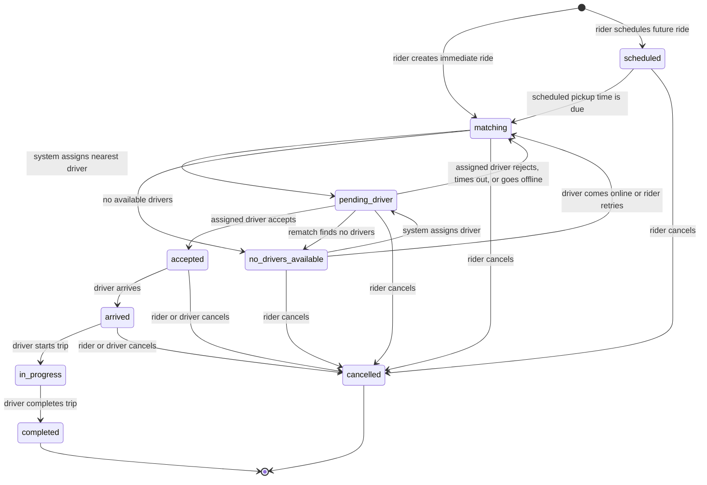
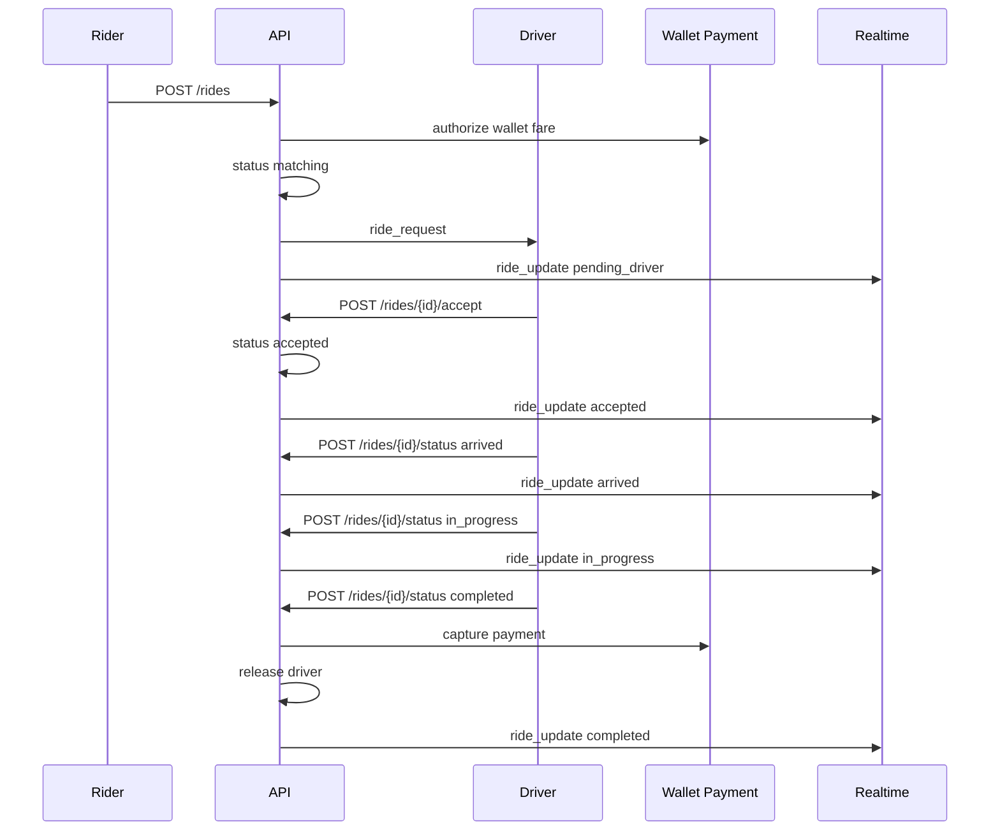

# Ride Lifecycle Diagram

Ride state transitions are enforced by `ALLOWED_RIDE_TRANSITIONS` in
`RideOpsServer/app/main.py`. Terminal states are `completed` and `cancelled`.

## State Diagram

## Transition Table

| From | To | Actor | Trigger |
| --- | --- | --- | --- |
| `scheduled` | `matching` | system | scheduled pickup time is due |
| `scheduled` | `cancelled` | rider | `POST /rides/{ride_id}/cancel` |
| `matching` | `pending_driver` | system | nearest available driver assigned |
| `matching` | `no_drivers_available` | system | no available driver candidates |
| `matching` | `cancelled` | rider | `POST /rides/{ride_id}/cancel` |
| `no_drivers_available` | `matching` | system or driver flow | waiting ride is retried |
| `no_drivers_available` | `pending_driver` | system | driver becomes available and is assigned |
| `no_drivers_available` | `cancelled` | rider | `POST /rides/{ride_id}/cancel` |
| `pending_driver` | `accepted` | driver | `POST /rides/{ride_id}/accept` |
| `pending_driver` | `matching` | driver or system | `POST /rides/{ride_id}/reject`, dispatch timeout, or driver goes offline |
| `pending_driver` | `no_drivers_available` | system | rematching finds no candidates |
| `pending_driver` | `cancelled` | rider | `POST /rides/{ride_id}/cancel` |
| `accepted` | `arrived` | driver | `POST /rides/{ride_id}/status` with `arrived` |
| `accepted` | `cancelled` | rider or driver | `POST /rides/{ride_id}/cancel` |
| `arrived` | `in_progress` | driver | `POST /rides/{ride_id}/status` with `in_progress` |
| `arrived` | `cancelled` | rider or driver | `POST /rides/{ride_id}/cancel` |
| `in_progress` | `completed` | driver | `POST /rides/{ride_id}/status` with `completed` |

## Main Flow

